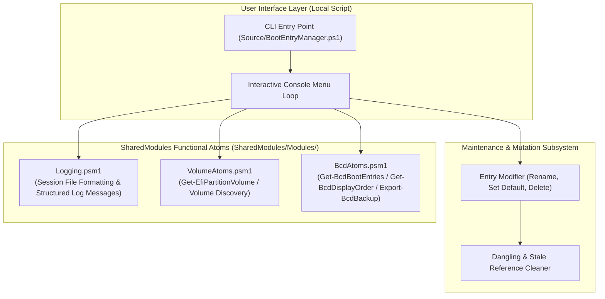

# BootEntryManager: Architecture Document

Module: docs/Architecture.md  
Authors: Rolf, BootEntryManager Architecture Team  
Version: 2.1.0  
Status: Authoritative Architecture  
Date: 2026-08-16  

---

## 1. Subsystem Architecture & Shared Atoms Integration

`BootEntryManager` is decoupled into local UI and operational workflows, backed by reusable **Functional Atoms** from [`SharedModules`](file:///D:/Git_Repositories/SharedModules):

---

## 2. Component Boundaries & Pipeline

### A. Discovery Pipeline (Shared Atoms)
1. **EFI Partition Resolution**: Invokes `Get-EfiPartitionVolume` from `VolumeAtoms.psm1` to identify the active EFI System Partition by GPT type GUID `{C12A7328-F81F-11D2-BA4B-00A0C93EC93B}` and resolve its `FileSystemLabel`.
2. **BCD Enumeration**: Leverages `BcdAtoms.psm1` to parse the `{bootmgr}` `displayorder` and enumerate all boot loader object records via `bcdedit /enum all /v`.
3. **Session Logging**: Initializes session log naming (`Format-SessionLogFileName`) and writes audit events through `Logging.psm1`.

### B. Backup & Safety Pipeline (Shared Atoms)
1. Prior to any state-mutating operation (rename, delete, default, import, or cleanup), invokes `Export-BcdBackup` from `BcdAtoms.psm1`.
2. Produces both `.bak` (binary hive) and `.txt` (human-readable annotated report).
3. Automatically cleans up transactional `.LOG` sidecars.

### C. Safe Test Execution Strategy
* **Unit Testing**: Tests parsing logic, regular expressions, and argument contracts against pre-captured static BCD text fixtures in [`tests/BootEntryManager.Tests.ps1`](file:///D:/Git_Repositories/BootEntryManager/tests/BootEntryManager.Tests.ps1).
* **Zero-Reboot Invariant**: Non-destructive mock testing ensures complete verification without triggering system restarts.
