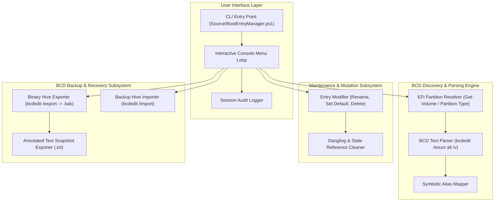

# BootEntryManager: Architecture Document

Module: docs/Architecture.md  
Authors: Rolf, BootEntryManager Architecture Team  
Version: 2.0.0  
Status: Authoritative Architecture  
Date: 2026-08-16  

---

## 1. Subsystem Architecture

`BootEntryManager` is organized into four decoupled functional subsystems:

---

## 2. Component Boundaries & Pipeline

### A. Discovery Pipeline
1. Identifies the active EFI System Partition by GPT partition type GUID `{C12A7328-F81F-11D2-BA4B-00A0C93EC93B}`.
2. Resolves partition volume label and establishes the session backup directory: `D:\OneDrive\Documents\Einstellungen\BCD`.
3. Executes `bcdedit /enum {bootmgr} /v` to extract the authoritative `displayorder` array.
4. Executes `bcdedit /enum all /v` to parse object GUIDs, descriptions, device paths, and firmware metadata.

### B. Backup & Safety Pipeline
1. Prior to any state-mutating operation, invokes the pre-modification safety backup.
2. Produces both `.bak` (binary hive) and `.txt` (human-readable annotated report).
3. Cleans up transactional `.LOG` sidecars.

### C. Safe Test Execution Strategy
* **Unit Testing**: Tests parsing logic, regular expressions, and argument contracts against pre-captured static BCD text files.
* **Zero-Reboot Invariant**: Non-destructive mock testing ensures full test coverage without triggering system restarts.
